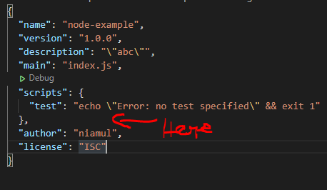
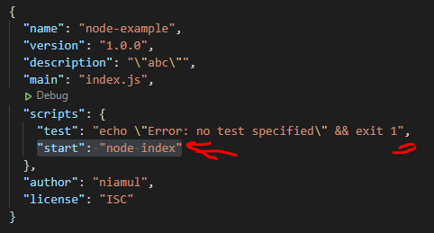
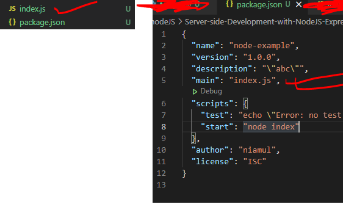
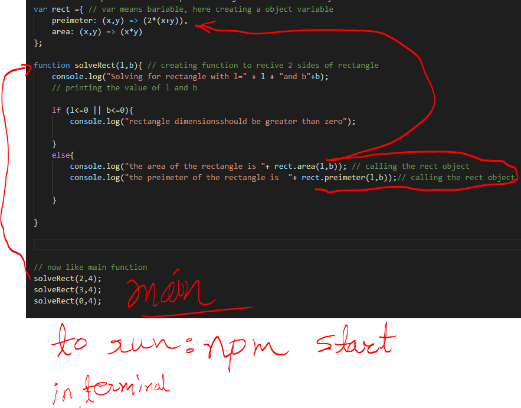

<a href="https://www.coursera.org/learn/server-side-nodejs/lecture/dUnyG/exercise-video-understanding-node-modules">tutorial</a>

1. At first, from terminal, locate the folder(where we going to do work)  
2. npm init
3. give package name
4. give description 
5. author: give a name
6. Now press enter (for rest of the items)
7. we will see package.json is created in that folder
8. now open package.json file, and add a line(script)  

#### "start": "node index"

9. create a file index.js in same directory where package.json located

### now simple example:

var rect ={ // var means bariable, here creating a object variable  
    preimeter: (x,y) => (2*(x+y)), 
    area: (x,y) => (x*y) 
};  

function solveRect(l,b){ // creating function to recive 2 sides of rectangle 
    console.log("Solving for rectangle with l=" + l + "and b"+b);  
    // printing the value of l and b 
 
    if (l<=0 || b<=0){ 
        console.log("rectangle dimensionsshould be greater than zero"); 
         
    } 
    else{ 
        console.log("the area of the rectangle is "+ rect.area(l,b)); // calling the rect object 
        console.log("the preimeter of the rectangle is  "+ rect.preimeter(l,b));// calling the rect object 

    } 

} 

  

// now like main function 
solveRect(2,4); 
solveRect(3,4); 
solveRect(0,4); 
