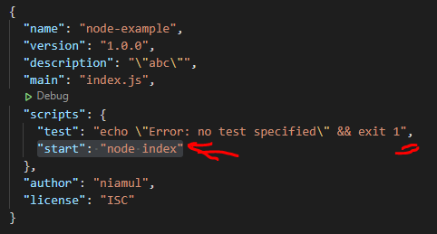

1. create a file rectangle.js in same directory where package.json and index.js located

index.js initially:

 package.json

2. in rectangle.js:
 
exports.perimeter = (x,y) =>(2*(x+y)), 
exports.area : (x,y) => (x*y); 

  

3. now we can use rectangle.js in side the index.js 
so,  