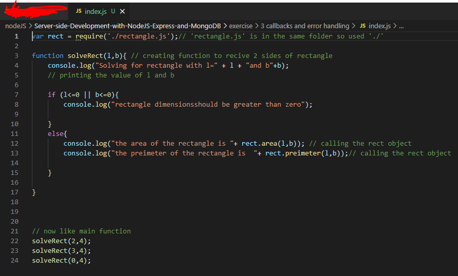
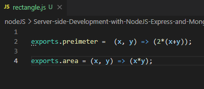

### This is the continuation of the 2nd  exercise "node module"
 
 
### initially the index.js and the node module "rectangle.js" files are:

## Now, Using Callbacks and Error Handling:

1. Update  rectangle.js as shown below:

## code index.js
 

var rect = require('./rectangle.js');// 'rectangle.js' is in the same folder so used './' 

function solveRect(l,b) { 
    console.log("Solving for rectangle with l = " 
                + l + " and b = " + b); 
    rect(l,b, (err,rectangle) => {  
 
// calling the module and passing l,b,callback => getting return error or value  
         
        if (err) { 
	        console.log("ERROR: ", err.message); 
	    } 
        else { 
            console.log("The area of the rectangle of dimensions l = " 
                + l + " and b = " + b + " is " + rectangle.area()); 
            console.log("The perimeter of the rectangle of dimensions l = " 
                + l + " and b = " + b + " is " + rectangle.perimeter()); 
        } 
    }); 
    console.log("This statement after the call to rect()"); 
}; 
 
 

// now like main function 
solveRect(2,4); 
solveRect(3,4); 
solveRect(0,4); 

 
 

 
## code rectangle.js  
module.exports = (x,y,callback) => { // receiving value x,y, callback(err,rectangle) 
    
    if (x <= 0 || y <= 0) 
// if two sides of rectangle is 0 or less the send: callbanck(err=error,rectrangle= null)  
        setTimeout(() =>  
            callback(new Error("Rectangle dimensions should be greater than zero: l = " 
                + x + ", and b = " + y),  
            null), 
            2000); 
     
    else
    // else  send: callbanck(err=null,rectrangle= values) 
        setTimeout(() =>  
            callback(null, { 
                perimeter: () => (2*(x+y)), 
                area:() => (x*y) 
            }),  
            2000); 
} 
 

