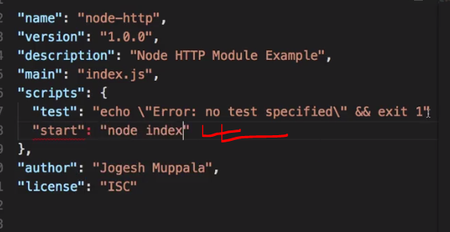
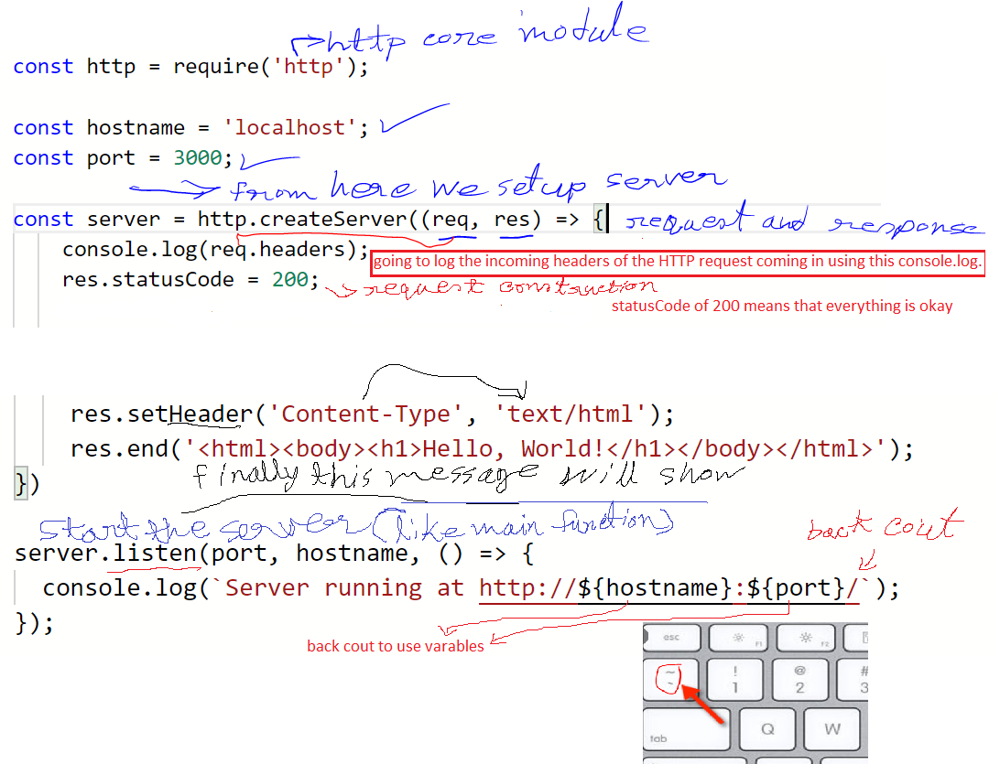
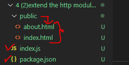
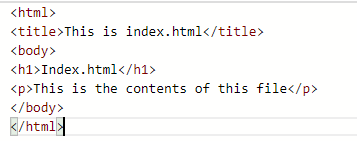
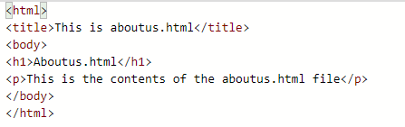
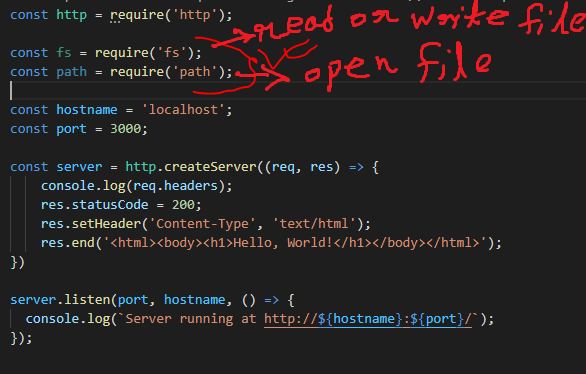
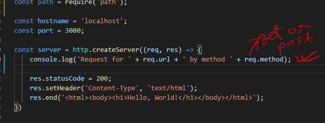
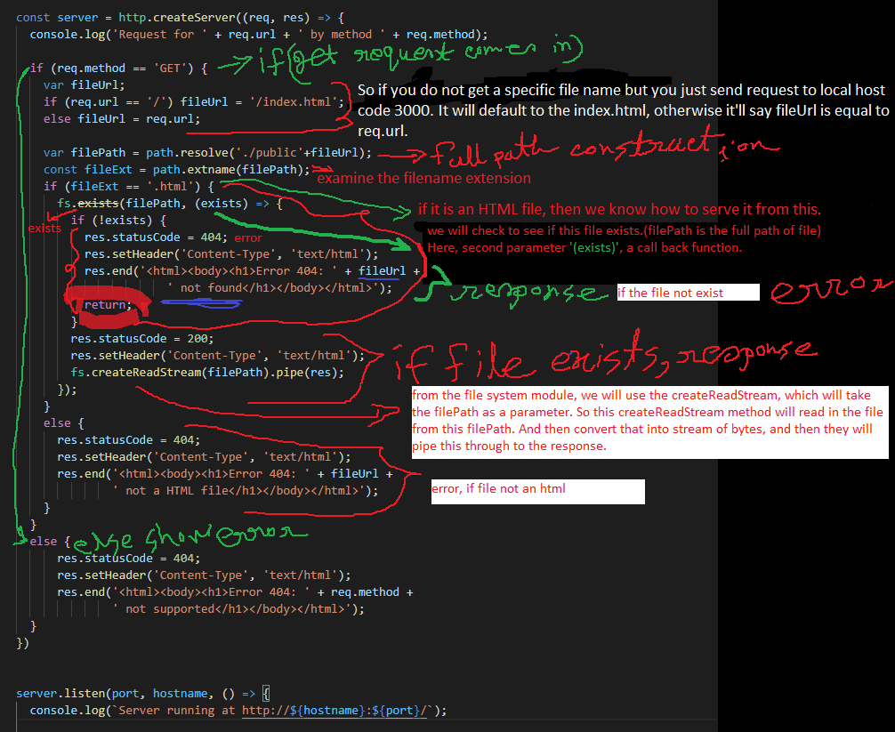

In this exercise, you will explore three core Node modules: HTTP, fs and path. At the end of this exercise, you will be able to: 

## Implement a simple HTTP Server 
## Implement a server that returns html files from a folder 

 

A Simple HTTP Server
 
Create a folder named node-http in the NodeJS folder and move into the folder.
 
In the node-http folder, create a subfolder named public. (to keep html files there)
 

#### Now,At the prompt, type the following to initialize a package.json file in the node-examples folder: 
### $ npm init
 
Accept the standard defaults suggested until you end up with a package.json file containing the following: 

in the package.json : 
 
Create a file named index.js and add the following code to it: 
We're going to configure this index.js to use the Node HTTP module 

### code:(index.js)
const http = require('http'); 
 
const hostname = 'localhost'; 
const port = 3000; 
 
const server = http.createServer((req, res) => { 
    console.log(req.headers); 
    res.statusCode = 200; 
    res.setHeader('Content-Type', 'text/html'); 
    res.end('<html><body><h1>Hello, World!</h1></body></html>'); 
}) 
 
server.listen(port, hostname, () => { 
  console.log(`Server running at http://${hostname}:${port}/`); 
}); 

  
 

## Now extend the http module further with html file:

 
Now,
In the public folder, create a file named index.html and add the following code to it:

 
Similarly create an aboutus.html file and add the following code to it: 

### now in index.js,  
Add "file system core module" and "path core module" in index.js
  to show the html files as response
 
 
### Now, insted of printing all log file to console log we will print only suficient information 
  

now we will change the way we send response:(here we will only cover get request)
  

### run the server by : npm start

## now if we write : http://localhost:3000/about.html
  

## code:
const http = require('http'); 
 
const fs = require('fs'); 
const path = require('path'); 
 
const hostname = 'localhost'; 
const port = 3000; 

  
const server = http.createServer((req, res) => { 
  console.log('Request for ' + req.url + ' by method ' + req.method); 
 
  if (req.method == 'GET') { 
    var fileUrl; 
    if (req.url == '/') fileUrl = '/index.html'; 
    else fileUrl = req.url; 
 
    var filePath = path.resolve('./public'+fileUrl); 
    const fileExt = path.extname(filePath); 
    if (fileExt == '.html') { 
      fs.exists(filePath, (exists) => { 
        if (!exists) { 
          res.statusCode = 404; 
          res.setHeader('Content-Type', 'text/html'); 
          res.end('<html><body><h1>Error 404: ' + fileUrl +  
                      ' not found</h1></body></html>'); 
          return; 
        } 
        res.statusCode = 200; 
        res.setHeader('Content-Type', 'text/html'); 
        fs.createReadStream(filePath).pipe(res); 
      }); 
    } 
    else { 
      res.statusCode = 404; 
      res.setHeader('Content-Type', 'text/html'); 
      res.end('<html><body><h1>Error 404: ' + fileUrl +  
              ' not a HTML file</h1></body></html>'); 
    } 
  } 
  else { 
      res.statusCode = 404; 
      res.setHeader('Content-Type', 'text/html'); 
      res.end('<html><body><h1>Error 404: ' + req.method +  
              ' not supported</h1></body></html>'); 
  } 
})
 
 
server.listen(port, hostname, () => { 
  console.log(`Server running at http://${hostname}:${port}/`); 
 
 

}); 